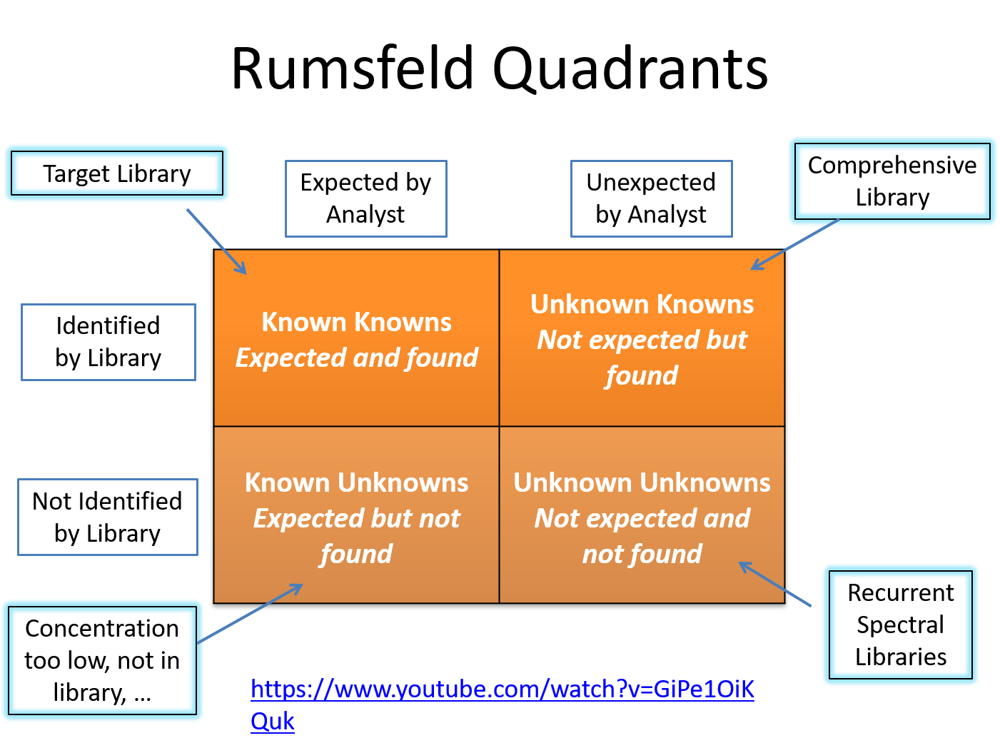

# **Introduction and concepts** {#Intro}

<br><br>


* _This is italic_
* __This is bold__
* Demonstrating subscript: H~2~SO~4~
* Superscript: ^13^C
* Inline code: `library(tidyverse)`
<br><br>


```{r startup, echo=FALSE, message=FALSE}

library(tidyverse)
library(kableExtra)
library(DiagrammeR)
library(plotly)
library(processx)

```


```{r target_vs_nontarget, echo = FALSE, fig.cap= "Comparison between target and nontarget analysis", fig.align='center'}

knitr::include_graphics("images/target_vs_nontarget.png")
```

```{r rumsfeldt, echo = FALSE, fig.cap= "Knowns and unknowns", fig.align='center'}


```

## Terminologies
<br><br>
- High resolution mass spectrometry <br>
- Non-target analysis <br>
- Suspect screening analysis <br>
- Semi-quantification <br>
- Pseudo-quantification <br>
- Data-dependent analysis (DDA) <br>
- Data-indenpendent analysis (DIA) <br>


